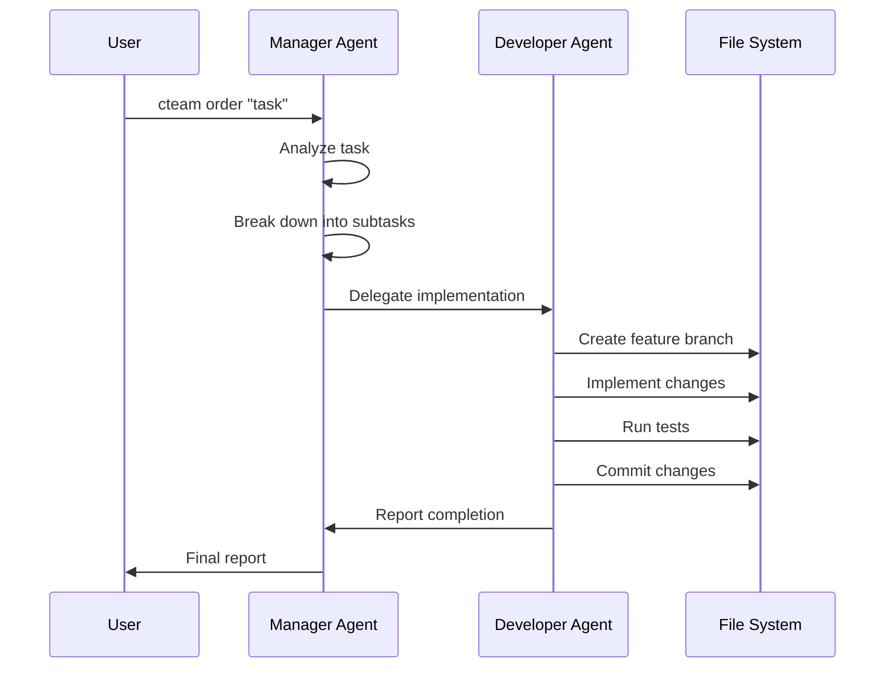

# Claude Team (cteam) - 設計ドキュメント

## アーキテクチャ概要

Claude Team は Claude Code CLI を基盤とした汎用的なマルチエージェント開発支援ツールです。tmux を使用したセッション管理により、複数のエージェントが協調してソフトウェア開発を支援します。

## システム構成

### 1. コンポーネント構成

```
┌─────────────────────────────────────────────────────────────┐
│                     cteam CLI Tool                          │
├─────────────────────────────────────────────────────────────┤
│  ┌─────────────┐  ┌─────────────┐  ┌─────────────────────┐  │
│  │    User     │  │   Manager   │  │    Developer        │  │
│  │    Pane     │  │   Agent     │  │    Agent            │  │
│  │             │  │             │  │                     │  │
│  │  - Commands │  │ - Task Mgmt │  │ - Implementation    │  │
│  │  - Results  │  │ - Delegation│  │ - Git Operations    │  │
│  │  - Files    │  │ - Reporting │  │ - Testing           │  │
│  └─────────────┘  └─────────────┘  └─────────────────────┘  │
│         │                 │                    │             │
│         └─────────────────┼────────────────────┘             │
│                          │                                   │
├─────────────────────────────────────────────────────────────┤
│                    tmux Session Manager                      │
├─────────────────────────────────────────────────────────────┤
│                    Project File System                       │
│  ┌─────────────────────────────────────────────────────────┐ │
│  │  .cteam/                                                │ │
│  │  ├── config.yaml                                        │ │
│  │  └── contexts/                                          │ │
│  │      ├── manager_context.md                             │ │
│  │      └── developer_context.md                           │ │
│  └─────────────────────────────────────────────────────────┘ │
└─────────────────────────────────────────────────────────────┘
```

### 2. プロセス構成

```
Main Process (cteam)
├── tmux Session Manager
│   ├── User Pane (bash)
│   ├── Manager Agent (claude)
│   └── Developer Agent (claude)
├── Helper Scripts
│   ├── order_manager.sh
│   ├── delegate_task.sh
│   └── report_completion.sh
└── Configuration Manager
    ├── Project Detection
    ├── Context Loading
    └── Session Management
```

## データフロー

### 1. タスク実行フロー



### 2. 通信フロー

```
┌─────────────┐    order_manager.sh    ┌─────────────┐
│    User     │ ────────────────────────→ │   Manager   │
│    Pane     │                         │   Agent     │
└─────────────┘                         └─────────────┘
                                               │
                                               │ delegate_task.sh
                                               ↓
                                        ┌─────────────┐
                                        │ Developer   │
                                        │   Agent     │
                                        └─────────────┘
                                               │
                                               │ report_completion.sh
                                               ↓
                                        ┌─────────────┐
                                        │   Manager   │
                                        │   Agent     │
                                        └─────────────┘
```

## ファイル構造

### 1. cteam ツール構造

```
cteam/
├── bin/
│   └── cteam                    # メインエントリーポイント
├── src/
│   ├── tmux_manager.sh         # tmux セッション管理
│   ├── agent_launcher.sh       # エージェント起動ロジック
│   ├── order_manager.sh        # ユーザー指示の送信管理
│   ├── delegate_task.sh        # Manager から Developer へのタスク委譲
│   ├── report_completion.sh    # Developer から Manager への完了報告
│   └── complete.sh            # 簡易完了通知
├── config/
│   └── contexts/              # デフォルトエージェントコンテキスト
│       ├── manager_context.md
│       └── developer_context.md
├── README.md
├── DESIGN.md
└── CLAUDE.md                  # プロジェクト固有の指示
```

### 2. プロジェクト固有構造

```
user-project/
├── .cteam/
│   ├── config.yaml            # プロジェクト設定
│   └── contexts/              # カスタマイズされたコンテキスト
│       ├── manager_context.md
│       └── developer_context.md
├── src/
├── docs/
└── ... (project files)
```

## コンフィギュレーション管理

### 1. config.yaml スキーマ

```yaml
project:
  name: string                 # プロジェクト名
  root: string                # プロジェクトルートパス

agents:
  manager:
    context: string           # Manager コンテキストファイルパス
    model: string            # 使用する Claude モデル (オプション)
  developer:
    context: string          # Developer コンテキストファイルパス
    model: string           # 使用する Claude モデル (オプション)

session:
  name: string              # tmux セッション名
  layout: string           # tmux レイアウト (オプション)
  
git:
  default_branch: string    # デフォルトブランチ (オプション)
  feature_prefix: string   # フィーチャーブランチプレフィックス (オプション)
```

### 2. コンテキストファイル構造

各エージェントのコンテキストファイルは Markdown 形式で以下の構造を持ちます：

```markdown
# Agent Context

## Primary Responsibilities
- 責任1
- 責任2

## Workflow Process
1. ステップ1
2. ステップ2

## Communication Methods
- 通信方法1
- 通信方法2

## Important Notes
- 重要な注意事項
```

## セッション管理

### 1. tmux セッション構成

```
Session: cteam_projectname
├── Window 0: claude-team
│   ├── Pane 0: User Workspace
│   ├── Pane 1: Manager Agent (Claude)
│   └── Pane 2: Developer Agent (Claude)
```

### 2. ペイン間通信

```bash
# User → Manager
tmux send-keys -t session:0.1 "message" Enter

# Manager → Developer  
tmux send-keys -t session:0.2 "message" Enter

# Developer → Manager
tmux send-keys -t session:0.1 "message" Enter
```

## エージェント設計

### 1. Manager Agent

**役割:**
- ユーザー指示の受領・分析
- タスクの分解・優先順位付け
- Developer Agent への委譲
- 進捗管理・報告

**主要機能:**
- 自然言語による指示理解
- タスク分解アルゴリズム
- 委譲フォーマット生成
- 完了確認・品質チェック

### 2. Developer Agent

**役割:**
- 実装タスクの実行
- コード生成・修正
- テストの実行
- Git 操作

**主要機能:**
- コード生成・リファクタリング
- テスト自動実行
- ブランチ管理
- 完了報告生成

## 拡張性

### 1. 新しいエージェントタイプの追加

1. `config/contexts/` に新しいコンテキストファイルを作成
2. `agent_launcher.sh` にエージェントタイプを追加
3. `tmux_manager.sh` でペイン構成を調整

### 2. カスタムヘルパースクリプトの追加

```bash
# src/custom_helper.sh を作成
#!/bin/bash
# カスタムロジックを実装

# エージェントコンテキストから使用
./src/custom_helper.sh "parameters"
```

### 3. 設定オプションの拡張

1. `config.yaml` スキーマを拡張
2. 初期化スクリプトで新しい設定を処理
3. エージェントコンテキストで設定を参照

## セキュリティ考慮事項

### 1. ファイルアクセス制御

- `.cteam/` ディレクトリの権限管理
- 機密情報を含むファイルの除外設定
- Git ignore パターンの適切な設定

### 2. エージェント権限制限

- Claude Code の `--dangerously-skip-permissions` フラグの使用検討
- プロジェクトスコープでの操作制限
- 外部ネットワークアクセスの制限

### 3. コマンド実行制限

- シェルインジェクション対策
- パス検証・サニタイゼーション
- 危険なコマンドの実行防止

## パフォーマンス最適化

### 1. セッション管理

- 不要なプロセスの削減
- メモリ使用量の監視
- tmux セッションの効率的な管理

### 2. エージェント応答性

- コンテキストファイルサイズの最適化
- 不要な出力の削減
- 応答時間の監視

### 3. ファイル操作

- 大きなファイルの効率的な処理
- 並列処理の活用
- キャッシュ機能の実装検討

## トラブルシューティング

### 1. 一般的な問題

| 問題 | 原因 | 解決方法 |
|------|------|----------|
| セッション開始失敗 | tmux 未インストール | tmux をインストール |
| エージェント起動失敗 | Claude CLI 未インストール | Claude Code CLI をインストール |
| 権限エラー | ファイル権限不足 | 適切な権限を設定 |

### 2. ログ出力

- tmux セッションログの確認
- エージェント出力の記録
- エラーメッセージの詳細化

### 3. デバッグモード

```bash
# デバッグモードでの実行
CTEAM_DEBUG=1 cteam start

# 詳細ログの有効化
CTEAM_VERBOSE=1 cteam order "task"
```

## 今後の発展計画

### 1. 短期目標

- WebUI の追加
- より多くのエージェントタイプのサポート
- 設定管理の改善

### 2. 中期目標

- クラウド統合
- チーム協業機能
- プロジェクトテンプレート

### 3. 長期目標

- AI モデルの選択肢拡大
- 高度な自動化機能
- エンタープライズ機能